# Scenarios

Six plans under `examples/`. Each `plan.yaml` passes `validate` and `schedule`. Charts are the Mermaid blocks `gantt` writes. Names are roles from `roster.yaml` (research, creative-director, social, accuracy, chief-of-staff, cloud-worker, human, machine-pool). No personal names.

Run the commands from the repository root. `schedule` and `gantt` rewrite the generated files in place; a second run matches the first.

## 1. Solo feature with a review gate

A single implementer ships one change. Accuracy reviews it. A person approves the merge. The merge task is irreversible, so `needs_human` is true.

Directory: `examples/01-solo-feature`. Plan id `solo-feature-2026-10`.

```bash
python3 -m planner validate examples/01-solo-feature
python3 -m planner schedule examples/01-solo-feature
python3 -m planner gantt examples/01-solo-feature
python3 -m planner ready examples/01-solo-feature
```

`validate` prints `ok: examples/01-solo-feature/plan.yaml (3 tasks)`.

`schedule` prints:

```
wrote examples/01-solo-feature/schedule.yaml: makespan 3h, critical path T1 -> T2 -> M1 (origin)
```

`ready` prints:

```
plan: solo-feature-2026-10
dispatch:
  T1 | cloud-worker | 2h | Implement the feature
awaiting_human:
  (none)
```

The merge gate is not waiting, because T2 has not finished. After T1 and T2 are done, M1 moves to `awaiting_human` and drops out of `dispatch`.

`examples/01-solo-feature/gantt.md` records CPM duration 3h, resource-constrained makespan 3h, critical path T1, T2, M1:

```mermaid
gantt
    title Ship a small feature v1
    dateFormat HH:mm
    axisFormat %H:%M
    section Build
    T1 Implement the feature - cloud-worker :crit, t1, 09:00, 2h
    section Review
    T2 Review the change - accuracy :crit, t2, 11:00, 1h
    section Gate
    M1 Approve the merge - human :milestone, crit, m1, 12:00, 0m
```



## 2. Multi-agent content launch

Research, then social, then design, then Accuracy, then a human publish approval. Publish is irreversible.

Directory: `examples/02-content-launch`. Plan id `content-launch-2026-10`.

```bash
python3 -m planner validate examples/02-content-launch
python3 -m planner schedule examples/02-content-launch
python3 -m planner gantt examples/02-content-launch
python3 -m planner ready examples/02-content-launch
python3 -m planner status examples/02-content-launch
```

`schedule` prints:

```
wrote examples/02-content-launch/schedule.yaml: makespan 6h, critical path T1 -> T2 -> T3 -> T4 -> M1 (origin)
```

`ready` prints:

```
plan: content-launch-2026-10
dispatch:
  T1 | research | 2h | Research the announcement
awaiting_human:
  (none)
```

`status` includes `critical_path: T1 -> T2 -> T3 -> T4 -> M1`, `cpm_duration_hours: 6`, and `makespan_hours: 6`.

```mermaid
gantt
    title Multi-agent content launch v1
    dateFormat HH:mm
    axisFormat %H:%M
    section Research
    T1 Research the announcement - research :crit, t1, 09:00, 2h
    section Writing
    T2 Write the announcement - social :crit, t2, 11:00, 2h
    section Design
    T3 Design the image - creative-director :crit, t3, 13:00, 1h
    section Review
    T4 Check the package - accuracy :crit, t4, 14:00, 1h
    section Gate
    M1 Approve publication - human :milestone, crit, m1, 15:00, 0m
```



## 3. Study with a CPU phase and a GPU handoff

CPU work stays on `research`. The training task is assigned to `cloud-worker`, a roster entry with `kind: cloud_agent` and the `gpu` capability. That is the external executor: a person or another agent can hold the same assignment if they are on the roster with `gpu`. The plan ends at a handoff milestone.

Directory: `examples/03-ml-handoff`. Plan id `ml-handoff-2026-10`.

```bash
python3 -m planner validate examples/03-ml-handoff
python3 -m planner schedule examples/03-ml-handoff
python3 -m planner gantt examples/03-ml-handoff
python3 -m planner ready examples/03-ml-handoff
```

`schedule` prints:

```
wrote examples/03-ml-handoff/schedule.yaml: makespan 8h, critical path T1 -> T2 -> T3 -> M1 (origin)
```

`ready` prints:

```
plan: ml-handoff-2026-10
dispatch:
  T1 | research | 2h | Prepare the dataset
awaiting_human:
  (none)
```

T1 and T2 share `research`, whose capacity is 1, so the CPU phase is serial (0–2h, then 2–4h). T3 runs 4h on the cloud worker. M1 is a zero-duration milestone at 8h.

```mermaid
gantt
    title Study with a GPU handoff v1
    dateFormat HH:mm
    axisFormat %H:%M
    section CPU
    T1 Prepare the dataset - research :crit, t1, 09:00, 2h
    T2 Write the training note - research :crit, t2, 11:00, 2h
    section GPU
    T3 Run training - cloud-worker :crit, t3, 13:00, 4h
    section Handoff
    M1 Accept the handoff - human :milestone, crit, m1, 17:00, 0m
```



## 4. Shared machine pool

Six independent two-hour batches are assigned to `machine-pool`, capacity 4. `max_parallel` is 6, so the plan cap does not bind first. The roster entry is the pool: the scheduler has no separate machine resource.

Directory: `examples/04-machine-pool`. Plan id `machine-pool-2026-10`.

```bash
python3 -m planner validate examples/04-machine-pool
python3 -m planner schedule examples/04-machine-pool
python3 -m planner gantt examples/04-machine-pool
python3 -m planner status examples/04-machine-pool
```

`schedule` prints:

```
wrote examples/04-machine-pool/schedule.yaml: makespan 4h, critical path J1 (origin)
```

`status` includes `cpm_duration_hours: 2` and `makespan_hours: 4`. CPM assumes unlimited machines, so every batch has zero slack and the critical path stored is one of them (`J1`). The resource-constrained schedule starts four batches at 09:00 and the other two at 11:00. `ready` still lists all six as dispatchable, because the queue tests dependencies, not capacity.

```mermaid
gantt
    title Shared machine pool v1
    dateFormat HH:mm
    axisFormat %H:%M
    section Pool
    J1 Run batch 1 - machine-pool :crit, j1, 09:00, 2h
    J2 Run batch 2 - machine-pool :crit, j2, 09:00, 2h
    J3 Run batch 3 - machine-pool :crit, j3, 09:00, 2h
    J4 Run batch 4 - machine-pool :crit, j4, 09:00, 2h
    J5 Run batch 5 - machine-pool :crit, j5, 11:00, 2h
    J6 Run batch 6 - machine-pool :crit, j6, 11:00, 2h
```



## 5. A slipping plan, reschedule, and calibration

Implementation is `in_progress`. It started at the origin and has already logged 4 hours against a raw expected of 2 hours (`optimistic` 1, `likely` 2, `pessimistic` 3). The plan sets `calibration_override.factor` to 1.5, which is the factor `estimate` will preview. The committed files are the plan before `replan` and before `apply-calibration`. Those two commands rewrite the plan.

Directory: `examples/05-slipping-plan`. Plan id `slipping-plan-2026-10`.

```bash
python3 -m planner validate examples/05-slipping-plan
python3 -m planner gantt examples/05-slipping-plan
```

```bash
python3 -m planner schedule examples/05-slipping-plan
```

`schedule` still lays the origin graph out at the raw duration:

```
wrote examples/05-slipping-plan/schedule.yaml: makespan 3h, critical path T1 -> T2 (origin)
```

```bash
python3 -m planner status examples/05-slipping-plan
```

`status` reports the slip:

```
schedule_variance: 4h actual / 2h expected (n=1, pooled ratio 2.0000)
```

```bash
python3 -m planner estimate examples/05-slipping-plan
```

`estimate` reads `calibration.yaml` when that file exists, then applies the plan override first. The task lines are:

```
  T1 | cloud-worker | coding | raw 2h | factor 1.5 | n=0 | basis plan_factor | preview 3h | stored (none)
  T2 | accuracy | accuracy_review | raw 1h | factor 1.5 | n=0 | basis plan_factor | preview 1.5h | stored (none)
```

```bash
python3 -m planner calibrate
```

`calibrate` scans live plans under `plans/`, not `examples/`. With no done-task actuals in those plans it prints `samples: 0`. `--apply` would rebuild `calibration.yaml` from done tasks only. This example is still `in_progress`, so it does not move that file. The override is what the preview uses until a done task exists.

Origin chart (`examples/05-slipping-plan/gantt.md`). T1 is marked active because it is in progress:

```mermaid
gantt
    title Slipping implementation v1
    dateFormat HH:mm
    axisFormat %H:%M
    section Build
    T1 Implement the change - cloud-worker :crit, active, t1, 09:00, 2h
    section Review
    T2 Review the change - accuracy :crit, t2, 11:00, 1h
```



Reschedule from 15:00, six hours after the origin. Remaining work on T1 is `max(0, expected - actual)` = 0, so T1 is frozen at its start and the review is pushed to that clock. Copy the directory first if you want to keep this checkout unchanged.

```bash
python3 -m planner replan examples/05-slipping-plan --now --reason "implementation ran long" --at 2026-10-08T15:00:00-05:00
```

On the committed plan the command prints:

```
replan wrote schedule.yaml and gantt.md at version 2. Frozen: T1. Makespan 3h -> 7h.
```

Write the preview hours beside the raw triple. This also bumps `version`.

```bash
python3 -m planner apply-calibration examples/05-slipping-plan --at 2026-10-08T15:00:00-05:00
```

On a fresh copy of the committed plan it prints:

```
wrote calibrated hours on 2 tasks in slipping-plan-2026-10 at version 2
```

Optimistic, likely, and pessimistic stay 1, 2, and 3 on T1. `calibrated` becomes 3 and 1.5. A later `apply-calibration` multiplies the raw expected again, so the factor does not compound.

## 6. Sub-plan rollup

`examples/06-program/child` is a two-task study (draft 2h, check 1h, makespan 3h). The parent task `T1` points at it with `subplan: examples/06-program/child` and its own estimate is 1h. The scheduler replaces that 1h with the child makespan.

```bash
python3 -m planner validate examples/06-program
python3 -m planner validate examples/06-program/child
python3 -m planner schedule examples/06-program
python3 -m planner schedule examples/06-program/child
python3 -m planner gantt examples/06-program
python3 -m planner gantt examples/06-program/child
python3 -m planner status examples/06-program
```

Child schedule:

```
wrote examples/06-program/child/schedule.yaml: makespan 3h, critical path C1 -> C2 (origin)
```

Parent schedule:

```
wrote examples/06-program/schedule.yaml: makespan 4h, critical path T1 -> T2 (origin)
```

`status` on the parent includes `makespan_hours: 4` and `cpm_duration_hours: 4`. The Gantt bar for T1 is 3h, not the 1h written on the task. `ready` still prints the task's own expected hours (`T1 | research | 1h | Run the study`). The chart is the rolled duration.

Parent chart. The file also says `Subplan rollup: T1 is planned`.

```mermaid
gantt
    title Study program v1
    dateFormat HH:mm
    axisFormat %H:%M
    section Study
    T1 Run the study - research :crit, t1, 09:00, 3h
    section Package
    T2 Package the result - chief-of-staff :crit, t2, 12:00, 1h
```



Child chart:

```mermaid
gantt
    title Study notes v1
    dateFormat HH:mm
    axisFormat %H:%M
    section Study
    C1 Draft the note - research :crit, c1, 09:00, 2h
    C2 Check the note - accuracy :crit, c2, 11:00, 1h
```


