# Gantt

Generated from `plan.yaml` by `python -m planner gantt`. Do not edit by hand.

- Plan: solo-feature-2026-10 v1
- Origin: 2026-10-08T09:00:00-05:00
- CPM duration: 3h (std dev 0.3333h along the critical path)
- Resource-constrained makespan: 3h
- Critical path: T1, T2, M1
- `crit` means unconstrained CPM slack is zero. Bar times are the resource-constrained schedule.

| ID | Start | Finish | Slack | Assignee | Critical |
| --- | --- | --- | --- | --- | --- |
| T1 | 0 | 2 | 0 | cloud-worker | yes |
| T2 | 2 | 3 | 0 | accuracy | yes |
| M1 | 3 | 3 | 0 | human | yes |

```mermaid
gantt
    title Ship a small feature v1
    dateFormat HH:mm
    axisFormat %H:%M
    section Build
    T1 Implement the feature - cloud-worker :crit, t1, 09:00, 2h
    section Review
    T2 Review the change - accuracy :crit, t2, 11:00, 1h
    section Gate
    M1 Approve the merge - human :milestone, crit, m1, 12:00, 0m
```

