# Gantt

Generated from `plan.yaml` by `python -m planner gantt`. Do not edit by hand.

- Plan: ml-handoff-2026-10 v1
- Origin: 2026-10-08T09:00:00-05:00
- CPM duration: 8h (std dev 0h along the critical path)
- Resource-constrained makespan: 8h
- Critical path: T1, T2, T3, M1
- `crit` means unconstrained CPM slack is zero. Bar times are the resource-constrained schedule.

| ID | Start | Finish | Slack | Assignee | Critical |
| --- | --- | --- | --- | --- | --- |
| T1 | 0 | 2 | 0 | research | yes |
| T2 | 2 | 4 | 0 | research | yes |
| T3 | 4 | 8 | 0 | cloud-worker | yes |
| M1 | 8 | 8 | 0 | human | yes |

```mermaid
gantt
    title Study with a GPU handoff v1
    dateFormat HH:mm
    axisFormat %H:%M
    section CPU
    T1 Prepare the dataset - research :crit, t1, 09:00, 2h
    T2 Write the training note - research :crit, t2, 11:00, 2h
    section GPU
    T3 Run training - cloud-worker :crit, t3, 13:00, 4h
    section Handoff
    M1 Accept the handoff - human :milestone, crit, m1, 17:00, 0m
```

