# Gantt

Generated from `plan.yaml` by `python -m planner gantt`. Do not edit by hand.

- Plan: machine-pool-2026-10 v1
- Origin: 2026-10-08T09:00:00-05:00
- CPM duration: 2h (std dev 0h along the critical path)
- Resource-constrained makespan: 4h
- Critical path: J1
- `crit` means unconstrained CPM slack is zero. Bar times are the resource-constrained schedule.

| ID | Start | Finish | Slack | Assignee | Critical |
| --- | --- | --- | --- | --- | --- |
| J1 | 0 | 2 | 0 | machine-pool | yes |
| J2 | 0 | 2 | 0 | machine-pool | yes |
| J3 | 0 | 2 | 0 | machine-pool | yes |
| J4 | 0 | 2 | 0 | machine-pool | yes |
| J5 | 2 | 4 | 0 | machine-pool | yes |
| J6 | 2 | 4 | 0 | machine-pool | yes |

```mermaid
gantt
    title Shared machine pool v1
    dateFormat HH:mm
    axisFormat %H:%M
    section Pool
    J1 Run batch 1 - machine-pool :crit, j1, 09:00, 2h
    J2 Run batch 2 - machine-pool :crit, j2, 09:00, 2h
    J3 Run batch 3 - machine-pool :crit, j3, 09:00, 2h
    J4 Run batch 4 - machine-pool :crit, j4, 09:00, 2h
    J5 Run batch 5 - machine-pool :crit, j5, 11:00, 2h
    J6 Run batch 6 - machine-pool :crit, j6, 11:00, 2h
```

