# Gantt

Generated from `plan.yaml` by `python -m planner gantt`. Do not edit by hand.

- Plan: study-child-2026-10 v1
- Origin: 2026-10-08T09:00:00-05:00
- CPM duration: 3h (std dev 0h along the critical path)
- Resource-constrained makespan: 3h
- Critical path: C1, C2
- `crit` means unconstrained CPM slack is zero. Bar times are the resource-constrained schedule.

| ID | Start | Finish | Slack | Assignee | Critical |
| --- | --- | --- | --- | --- | --- |
| C1 | 0 | 2 | 0 | research | yes |
| C2 | 2 | 3 | 0 | accuracy | yes |

```mermaid
gantt
    title Study notes v1
    dateFormat HH:mm
    axisFormat %H:%M
    section Study
    C1 Draft the note - research :crit, c1, 09:00, 2h
    C2 Check the note - accuracy :crit, c2, 11:00, 1h
```

