# Gantt

Generated from `plan.yaml` by `python -m planner gantt`. Do not edit by hand.

- Plan: study-program-2026-10 v1
- Origin: 2026-10-08T09:00:00-05:00
- CPM duration: 4h (std dev 0h along the critical path)
- Resource-constrained makespan: 4h
- Critical path: T1, T2
- `crit` means unconstrained CPM slack is zero. Bar times are the resource-constrained schedule.

- Subplan rollup: T1 is planned
| ID | Start | Finish | Slack | Assignee | Critical |
| --- | --- | --- | --- | --- | --- |
| T1 | 0 | 3 | 0 | research | yes |
| T2 | 3 | 4 | 0 | chief-of-staff | yes |

```mermaid
gantt
    title Study program v1
    dateFormat HH:mm
    axisFormat %H:%M
    section Study
    T1 Run the study - research :crit, t1, 09:00, 3h
    section Package
    T2 Package the result - chief-of-staff :crit, t2, 12:00, 1h
```

