# Gantt

Generated from `plan.yaml` by `python -m planner gantt`. Do not edit by hand.

- Plan: launch-announce-2026-10 v2
- Origin: 2026-10-08T09:00:00-05:00
- CPM duration: 5.5h (std dev 0.4249h along the critical path)
- Resource-constrained makespan: 5.5h
- Critical path: T1, T2, T4, T5, M1, T7
- `crit` means unconstrained CPM slack is zero. Bar times are the resource-constrained schedule.

| ID | Start | Finish | Slack | Assignee | Critical |
| --- | --- | --- | --- | --- | --- |
| T1 | 0 | 2 | 0 | research | yes |
| T2 | 2 | 3.5 | 0 | social | yes |
| T3 | 2 | 4 | 0.5 | creative-director | no |
| T4 | 3.5 | 4.5 | 0 | accuracy | yes |
| T5 | 4.5 | 5 | 0 | chief-of-staff | yes |
| M1 | 5 | 5 | 0 | human | yes |
| T7 | 5 | 5.5 | 0 | social | yes |

```mermaid
gantt
    title Product announcement plan v2
    dateFormat HH:mm
    axisFormat %H:%M
    section Research
    T1 Research brief - research :crit, t1, 09:00, 2h
    section Content
    T2 Draft blog and social copy - social :crit, t2, 11:00, 90m
    T3 Create two launch images - creative-director :t3, 11:00, 2h
    section Review
    T4 Accuracy review of copy - accuracy :crit, t4, 12:30, 1h
    T5 Assemble launch package - chief-of-staff :crit, t5, 13:30, 30m
    section Gate and publish
    M1 Human approval - human :milestone, crit, m1, 14:00, 0m
    T7 Publish - social :crit, t7, 14:00, 30m
```

