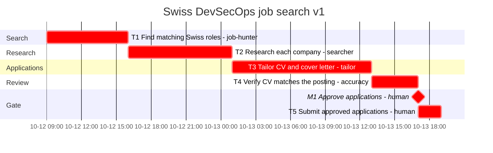

# Gantt

Generated from `plan.yaml` by `python -m planner gantt`. Do not edit by hand.

- Plan: swiss-job-search-2026-10 v1
- Origin: 2026-10-12T09:00:00+02:00
- CPM duration: 34h (std dev 2.8087h along the critical path)
- Resource-constrained makespan: 34h
- Critical path: T1, T2, T3, T4, M1, T5
- `crit` means unconstrained CPM slack is zero. Bar times are the resource-constrained schedule.

| ID | Start | Finish | Slack | Assignee | Critical |
| --- | --- | --- | --- | --- | --- |
| T1 | 0 | 7 | 0 | job-hunter | yes |
| T2 | 7 | 16 | 0 | searcher | yes |
| T3 | 16 | 28 | 0 | tailor | yes |
| T4 | 28 | 32 | 0 | accuracy | yes |
| M1 | 32 | 32 | 0 | human | yes |
| T5 | 32 | 34 | 0 | human | yes |

