# Gantt

Generated from `plan.yaml` by `python -m planner gantt`. Do not edit by hand.

- Plan: template-brief v2
- Origin: 2026-10-08T09:00:00-05:00
- CPM duration: 1.5h (std dev 0h along the critical path)
- Resource-constrained makespan: 1.5h
- Critical path: T1, T2, M1
- `crit` means unconstrained CPM slack is zero. Bar times are the resource-constrained schedule.

| ID | Start | Finish | Slack | Assignee | Critical |
| --- | --- | --- | --- | --- | --- |
| T1 | 0 | 1 | 0 | research | yes |
| T2 | 1 | 1.5 | 0 | accuracy | yes |
| M1 | 1.5 | 1.5 | 0 | human | yes |

```mermaid
gantt
    title Annotated template v2
    dateFormat HH:mm
    axisFormat %H:%M
    section Draft
    T1 Draft the brief - research :crit, t1, 09:00, 1h
    section Review
    T2 Check the brief - accuracy :crit, t2, 10:00, 30m
    section Gate
    M1 Approve the brief - human :milestone, crit, m1, 10:30, 0m
```

